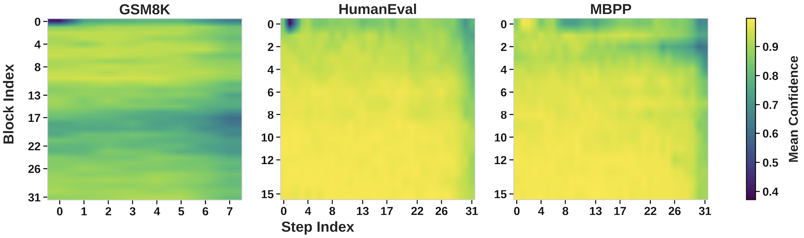
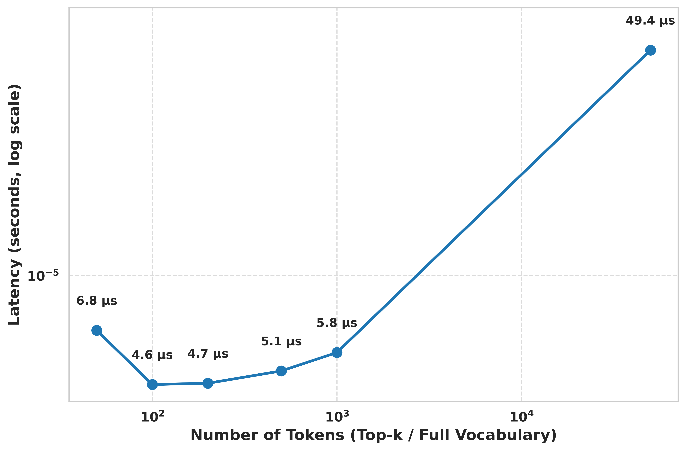

# CadLLM: Training‑Free Confidence‑Aware Decoding for Diffusion LLMs

CadLLM is a training‑free, plug‑and‑play controller that improves the inference throughput of masked diffusion language models (dLLMs) by adapting decoding policies based on lightweight confidence signals produced by the model itself. Across GSM8K, MATH, MBPP and HumanEval, CadLLM delivers up to 2.28× throughput over strong Fast‑dLLM baselines while maintaining competitive accuracy (single NVIDIA H100).

<div align="center">
  
  <p>CadLLM replaces fixed schedules with confidence‑aware adaptive policies: block size, step budget, vocabulary size, and threshold.</p>
  <br/>
  
  
</div>

## Why CadLLM?

- Diffusion LLMs refine sequences over multiple steps, incurring high inference cost compared to autoregressive decoding.
- Fixed decoding schedules miss opportunities to save compute where predictions are already stable, and to spend it where uncertainty remains.
- CadLLM introduces four confidence‑guided policies that dynamically reallocate computation without retraining.

## Core Ideas

- **Adaptive block size (B_t)**: Scale the active block proportionally to recent average confidence to amortize forward passes in easy regions and localize refinement in hard ones.
- **Adaptive steps (S_t)**: Allocate more refinement steps when confidence is low and fewer when it is high to balance speed and quality.
- **Adaptive vocabulary size (V_t)**: Narrow or widen the sampling subset based on phase, confidence, and short‑range repetition to reduce softmax cost while avoiding degeneracy.
- **Adaptive threshold (τ_t)**: Use a progress‑aware commit gate that is stricter early and more permissive later to prevent premature or redundant writes.

All four are training‑free and model‑agnostic, and work with either prefix‑only or dual KV caching.

## Project Structure

```
.
├── llada/
│   ├── cadllm_generate.py        # CadLLM decoding with adaptive policies
│   ├── eval_llada.py             # lm-eval harness adapter (registers `llada_dist`)
│   ├── eval_*.sh                 # Example evaluation scripts (GSM8K, MATH, etc.)
│   └── model/                    # LLaDA model definitions
├── asset/                        # Figures used in this README
│   ├── step_block_heatmap.png
│   ├── softmax_latency.png
│   └── algo_overview.png
```

## Install

```bash
# Python 3.10+ recommended
pip install -r requirements.txt
```

You will also need access to the LLaDA model weights (e.g., `GSAI-ML/LLaDA-8B-Instruct`).

## Quick Start

### Run the built‑in demo

```bash
python llada/cadllm_generate.py
```

This runs CadLLM on a small set of prompts and prints throughput and adaptive policy traces.

### Programmatic usage

```python
import torch
from transformers import AutoTokenizer
from llada.cadllm_generate import generate_cadllm
from llada.model.modeling_llada import LLaDAModelLM

device = 'cuda'
model = LLaDAModelLM.from_pretrained('GSAI-ML/LLaDA-8B-Instruct', trust_remote_code=True, torch_dtype=torch.bfloat16).to(device).eval()
tokenizer = AutoTokenizer.from_pretrained('GSAI-ML/LLaDA-8B-Instruct', trust_remote_code=True)

m = [{"role": "user", "content": "Explain diffusion LLMs in one sentence."}]
prompt = tokenizer.apply_chat_template(m, add_generation_prompt=True, tokenize=False)
input_ids = torch.tensor(tokenizer(prompt)['input_ids'], device=device).unsqueeze(0)

out, nfe, _ = generate_cadllm(
    model, input_ids,
    initial_steps=24, max_steps=90, gen_length=256,
    initial_block_length=24, temperature=0.0,
    remasking='low_confidence',
    adaptive_blocks=True, adaptive_steps=True,
    adaptive_threshold=True, adaptive_vocab_size=True,
    max_block=64, min_block=4, confidence_method='softmax',
    prophet_enabled=False  # optional early-exit via prophet (off by default)
)

print(tokenizer.decode(out[0][input_ids.shape[1]:], skip_special_tokens=True))
```

## Evaluation

Directly use each .sh script in `llada/` for evaluation:

```bash
# GSM8K / MATH / HumanEval / MBPP
bash llada/eval_gsm8k.sh
bash llada/eval_gsm8k_ablations.sh
bash llada/eval_math.sh
bash llada/eval_humaneval.sh
bash llada/eval_mbpp.sh
```

## Configuration

- **Adaptive policies**
  - `adaptive_blocks`: enable adaptive block via `calculate_adaptive_block_size`
  - `adaptive_steps`: enable adaptive step via `calculate_adaptive_step`
  - `adaptive_vocab_size`: enable adaptive vocabulary size via `calculate_adaptive_vocab_size`
  - `adaptive_threshold`: enable adaptive threshold via `calculate_adaptive_threshold`
- **Confidence methods**: `softmax` (default) or `entropy`
- **Cache modes**: `prefix` (default) or `dual`
- **Optional early exiting via prophet**: `prophet_enabled` (off by default)

### Main Results

Setup: Single NVIDIA H100. Benchmarks: GSM8K (5-shot), MATH (4-shot), MBPP (3-shot, pass@1), HumanEval (0-shot, pass@1). Generation lengths g=256 and g=512. Each cell shows: accuracy% · tokens/s (speedup vs. Fast‑dLLM threshold).

| Benchmark (g) | CadLLM (ours) | Fast‑dLLM (factor) | Fast‑dLLM (threshold) |
|---|---|---|---|
| GSM8K (256) | 78.01% · 120.07 (1.33×) | 76.19% · 119.18 (1.32×) | 79.00% · 90.40 (1.00×) |
| GSM8K (512) | 75.44% · 107.79 (1.37×) | 74.45% · 100.66 (1.27×) | 75.28% · 78.77 (1.00×) |
| MATH (256) | 32.06% · 106.84 (1.34×) | 32.22% · 109.97 (1.38×) | 32.40% · 79.58 (1.00×) |
| MATH (512) | 34.94% · 117.21 (1.14×) | 35.40% · 111.86 (1.08×) | 32.06% · 103.18 (1.00×) |
| MBPP (256) | 24.00% · 99.86 (1.37×) | 21.20% · 96.01 (1.31×) | 25.60% · 73.15 (1.00×) |
| MBPP (512) | 13.00% · 104.62 (1.35×) | 13.20% · 100.73 (1.30×) | 14.20% · 77.71 (1.00×) |
| HumanEval (256) | 35.97% · 220.81 (2.28×) | 32.92% · 132.28 (1.37×) | 37.19% · 96.84 (1.00×) |
| HumanEval (512) | 43.29% · 163.72 (1.74×) | 41.46% · 131.14 (1.38×) | 45.12% · 94.41 (1.00×) |

### Ablations (GSM8K, g=256)

| Mode | Tokens/s ↑ | Time (s) ↓ | Accuracy ↑ | NFE ↓ |
|---|---:|---:|---:|---:|
| ON (all adaptive) | 121.72 | 2501.10 | 78.01% | 86,816 |
| No V_t | 119.67 | 2547.25 | 74.41% | 86,666 |
| No S_t | 136.76 | 2235.68 | 76.12% | 76,955 |
| No B_t | 111.19 | 2751.77 | 78.32% | 92,344 |
| No τ_t | 34.57 | 8841.89 | 78.17% | 337,664 |
| OFF (all static) | 34.32 | 8908.60 | 78.01% | 337,664 |

## Upcoming Updates

- [ ] Integration with DREAM model to verify effectiveness across architectures.
- [ ] Integration with LLaDA‑V for multi‑modal math reasoning (MathVerse, MathVista).
